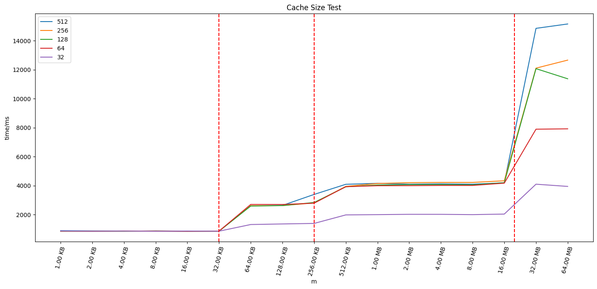
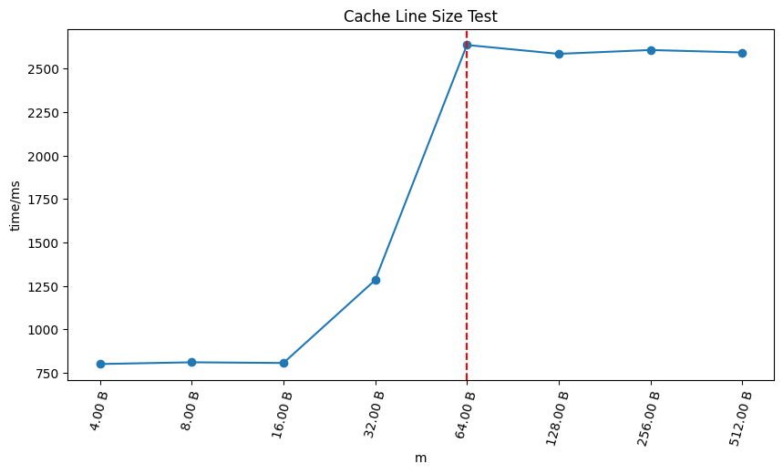
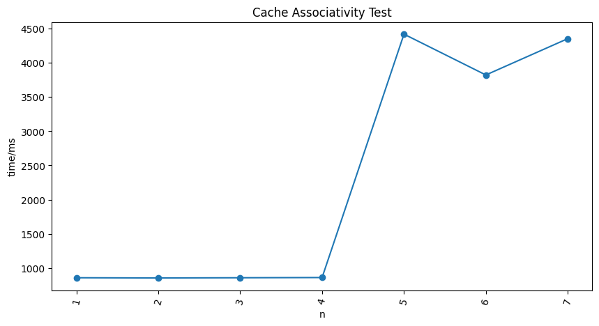

# 系统结构 Lab2

计 02 刘明道 2020011156

## 实验计算机参数

```bash
(base) lambda@zeus:~/calab2$ lscpu --cache
NAME ONE-SIZE ALL-SIZE WAYS TYPE        LEVEL  SETS PHY-LINE COHERENCY-SIZE
L1d       32K     256K    8 Data            1    64        1             64
L1i       32K     256K    8 Instruction     1    64        1             64
L2       256K       2M    8 Unified         2   512        1             64
L3        20M      20M   20 Unified         3 16384        1             6
```

CPU 详细参数见 `./lscpu.out` 。

## 测量缓存大小

- 访存序列

  设访存区间大小为 $m$ 字节，步长 $l$ ，访存序列为 $a_{m,l}(n)= (n \times l) \ \text{mod} \ m$，其中 $n=0,\cdots,1\times10^9$。实验中操作单位选为 `uint8_t` 。

- 实验结果如下图，其中横轴表示访存区间大小，不同曲线表示不同步长，纵轴表示用时

  

  ​红线分别表示用 `lscpu` 查询得到的单块 L1D cache 大小，单块 L2 cache 大小和 L3 cache 总大小。可见访存区间长度超过 L1D cache 和 L2 大小后，由于出现 cache miss，访存时间有显著提高，这验证了 L1D cache 和 L2 cache 的大小。

- 思考题

  > 理论上 L2 Cache 的测量与 L1 DCache 没有显著区别。但为什么 L1 DCache 结果匹配但是 L2 Cache 不匹配呢？你的实验有出现这个现象吗？请给出一个合理的解释。
  >
  > 提示：DCache v.s. Cache

  L1D cache 为数据专用 Cache 。L2 cache 为指令和数据共享，其中部分内容会被指令占用，这对数据来说会造成额外的 cache miss，因此测量值偏小。

## 测量缓存行大小

- 访存序列

  开 $m=1\text{GB}$  连续内存，设步长为 $l$ ，访存序列为 $a_{m,l}(n)=(n\times l) \ \text{mod} \ m$ ，其中 $n=1,\cdots,1\times10^8$。实验中操作单位选为 `uint8_t` 。

- 实验结果

  

  从步长为 64 开始，相邻两次访存不在同一个缓存行中，访存时间显著增加，这验证了缓存行大小为 64B。

## 测量缓存相连度

采取实验思路1

> - 使用一个 2 倍 Cache Size 大小的数组
>
> - 将数组分为 $2^{n}$ 块，只访问其中的奇数块
>
> - 逐渐增大 n 的取值，当某一次访问变慢的时候，$2^{n-2}$ 就是相联度

- 访存序列

  设 `L1DCache` 大小为 $m$，区间划分数$l=2^1,\cdots,2^7$ ，访存序列为 $a_{m,l}(n)=(n \times \frac{4m}{l}) \ \text{mod} \ 2m $。

- 算法分析
  
  设缓存的相连度为 $a=2^s$，当访存步长小于等于 $\frac{m}{a}$ 时，落在同一个 cache set 中的访存地址的数量将达到 $2a$，此时会出现替换，访存时间显著增加。若当 $l=2^n$ 时，访存时间显著增加，则由 $\frac{4m}{l}=\frac{m}{a}$ 可知 $a=2^{n-2}$。

- 实验结果

  

​	从实验结果可以看出，从 $l=2^5$ 开始，访存时间显著增加。由此得到的缓存相连度为 $a=2^{5-2}=8$，符合实际值。

## 优化矩阵乘法程序

进行了如下修改

```c++
// TODO: Your optimized code:
//======================================================
  constexpr size_t BLOCK_SIZE = 16;
  static_assert(MATRIX_SIZE % BLOCK_SIZE == 0, "MATRIX_SIZE % BLOCK_SIZE != 0");
  for (size_t blk = 0; blk < MATRIX_SIZE / BLOCK_SIZE; ++blk) {
      for (i = 0; i < MATRIX_SIZE; i ++) {
          for (k = blk * BLOCK_SIZE; k < (blk + 1) * BLOCK_SIZE; k ++) {
              register int tmp = a[i][k];
              for (j = 0; j < MATRIX_SIZE; j ++)
                  d[i][j] += tmp * b[k][j];
          }
      }
  }
// Stop here.
//======================================================
```

- 调整乘法计算顺序，交换 j 和 k，使内层循环访存连续
- 切分矩阵，设分块大小 `BLOCK_SIZE = 16` ，使分块矩阵乘法中的元素尽可能留在缓存中
- 将内层循环中不变的 `a[i][k]` 外提为寄存器变量

运行5次的，加速比均大于 3。结果如下

```bash
(base) lambda@zeus:~/calab2$ make mm
mkdir -p build
g++ -O0 -o build/mm mm.cpp
build/mm
time spent for original method : 10.6803 s
time spent for new method : 3.31862 s
time ratio of performance optimization : 3.21829
(base) lambda@zeus:~/calab2$ make mm
mkdir -p build
g++ -O0 -o build/mm mm.cpp
build/mm
time spent for original method : 10.6685 s
time spent for new method : 3.36606 s
time ratio of performance optimization : 3.16943
(base) lambda@zeus:~/calab2$ make mm
mkdir -p build
g++ -O0 -o build/mm mm.cpp
build/mm
time spent for original method : 10.9163 s
time spent for new method : 3.3348 s
time ratio of performance optimization : 3.27346
(base) lambda@zeus:~/calab2$ make mm
mkdir -p build
g++ -O0 -o build/mm mm.cpp
build/mm
time spent for original method : 10.5858 s
time spent for new method : 3.32434 s
time ratio of performance optimization : 3.18434
(base) lambda@zeus:~/calab2$ make mm
mkdir -p build
g++ -O0 -o build/mm mm.cpp
build/mm
time spent for original method : 10.5301 s
time spent for new method : 3.31352 s
time ratio of performance optimization : 3.17792
```

## 建议

可以考虑提供一台固定的计算机供同学们进行实验，CPU 的体质差异比较明显。

矩阵乘法这题可以考虑绑核 + 多次测量平均 + 提供一个稳定的评测平台 (?)

## 代码框架介绍

```bash
.
├── assets                         # 实验结果图
├── lscpu.cache.out                # lscpu --cache 输出
├── lscpu.out                      # lscpu 输出
├── Makefile                       # makefile
├── mm.cpp                         # 矩阵乘法加速
├── plot.ipynb                     # 实验结果绘图
├── read.cpp                       # 测量缓存大小
├── README.md                      # 本文件
├── result_cache_associativity.txt # 测量缓存相联度实验结果
├── result_cache_line_size.txt     # 测量缓存行大小实验结果
└── result_cache_size.txt          # 测量缓存大小实验结果
```

使用

```bash
make
```

运行缓存行测量实验和矩阵乘法加速。
