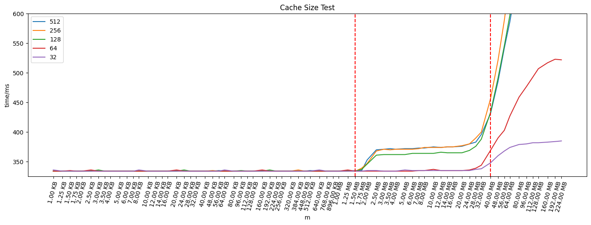
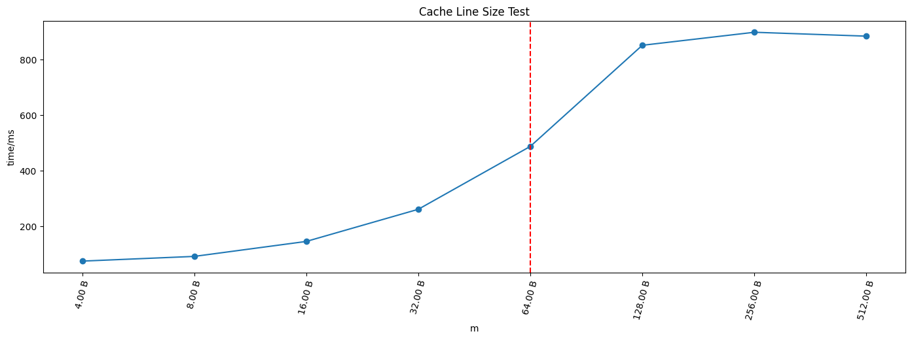
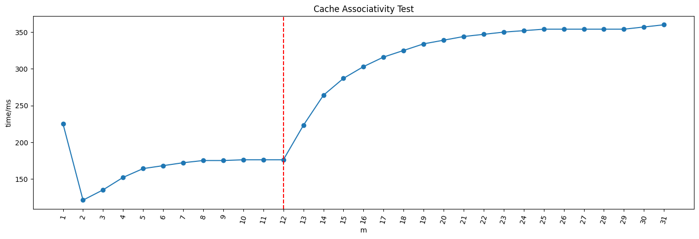

# 系统结构 Lab2

计 02 刘明道 2020011156

## 实验计算机参数

- 测量缓存大小的实验所用的计算机参数

  ```
  # lscpu
  Architecture:                    x86_64
  CPU op-mode(s):                  32-bit, 64-bit
  Byte Order:                      Little Endian
  Address sizes:                   46 bits physical, 57 bits virtual
  CPU(s):                          128
  On-line CPU(s) list:             0-108
  Off-line CPU(s) list:            109-127
  Thread(s) per core:              1
  Core(s) per socket:              32
  Socket(s):                       2
  NUMA node(s):                    2
  Vendor ID:                       GenuineIntel
  CPU family:                      6
  Model:                           106
  Model name:                      Intel(R) Xeon(R) Platinum 8336C CPU @ 2.30GHz
  Stepping:                        6
  CPU MHz:                         3000.000
  CPU max MHz:                     3500.0000
  CPU min MHz:                     800.0000
  BogoMIPS:                        4600.00
  Virtualization:                  VT-x
  L1d cache:                       1.5 MiB
  L1i cache:                       1 MiB
  L2 cache:                        40 MiB
  L3 cache:                        54 MiB
  NUMA node0 CPU(s):               0-31,64-95
  NUMA node1 CPU(s):               32-63,96-127
  
  # cd /sys/devices/system/cpu/cpu0/cache/index0
  # for f in *; do echo ${f}:`cat ${f}` ; done ;
  coherency_line_size:64
  id:0
  level:1
  number_of_sets:64
  physical_line_partition:1
  shared_cpu_list:0,64
  shared_cpu_map:00000000,00000001,00000000,00000001
  size:48K    
  type:Data
  uevent:
  ways_of_associativity:12
  ```

- 优化矩阵乘法的实验所用的计算机参数

  ```
  # WSL2, Ubuntu 20.04.3 LTS
  # lscpu
  Architecture:                    x86_64
  CPU op-mode(s):                  32-bit, 64-bit
  Byte Order:                      Little Endian
  Address sizes:                   39 bits physical, 48 bits virtual
  CPU(s):                          8
  On-line CPU(s) list:             0-7
  Thread(s) per core:              2
  Core(s) per socket:              4
  Socket(s):                       1
  Vendor ID:                       GenuineIntel
  CPU family:                      6
  Model:                           158
  Model name:                      Intel(R) Core(TM) i5-9300H CPU @ 2.40GHz
  Stepping:                        10
  CPU MHz:                         2400.001
  BogoMIPS:                        4800.00
  Hypervisor vendor:               Microsoft
  Virtualization type:             full
  L1d cache:                       128 KiB
  L1i cache:                       128 KiB
  L2 cache:                        1 MiB
  L3 cache:                        8 MiB
  Vulnerability Itlb multihit:     KVM: Mitigation: VMX unsupported
  Vulnerability L1tf:              Mitigation; PTE Inversion
  Vulnerability Mds:               Vulnerable: Clear CPU buffers attempted, no microcode; SMT Host state unknown
  Vulnerability Meltdown:          Mitigation; PTI
  Vulnerability Spec store bypass: Mitigation; Speculative Store Bypass disabled via prctl and seccomp
  Vulnerability Spectre v1:        Mitigation; usercopy/swapgs barriers and __user pointer sanitization
  Vulnerability Spectre v2:        Mitigation; Full generic retpoline, IBPB conditional, IBRS_FW, STIBP conditional, RSB filling
  Vulnerability Srbds:             Unknown: Dependent on hypervisor status
  Vulnerability Tsx async abort:   Not affected
  Flags:                           fpu vme de pse tsc msr pae mce cx8 apic sep mtrr pge mca cmov pat pse36 clflush mmx fxsr sse sse2 ss ht syscall nx pdpe1gb rdtscp lm constant_tsc rep_good nopl xtopology cpuid pni pclmulqdq ssse3 fma cx16 pcid sse4_1 sse4_2 movbe popcnt aes xsave avx f16c rdrand hypervisor lahf_lm abm 3dnowprefetch invpcid_single pti ssbd ibrs ibpb stibp fsgsbase bmi1 avx2 smep bmi2 erms invpcid rdseed adx smap clflushopt xsaveopt xsavec xgetbv1 xsaves flush_l1d arch_capabilities
  
  # cd /sys/devices/system/cpu/cpu0/cache/index0
  # for f in *; do echo ${f}:`cat ${f}` ; done ;
  coherency_line_size:64
  id:0
  level:1
  number_of_sets:64
  physical_line_partition:1
  shared_cpu_list:0-1
  shared_cpu_map:03
  size:32K
  type:Data
  uevent:
  ways_of_associativity:8
  ```

## 运行命令

前三个实验的运行命令为

```
g++ -O3 -o read -Wextra read.cpp && ./read 
```

## 测量缓存大小

- 访存序列

  设访存区间大小为 $m$ 字节，步长 $l$ ，访存序列为 $a_{m,l}(n)= (n \times l) \ \text{mod} \ m$，其中 $n=1,\cdots,1\times10^8$。实验中操作单位选为 `uint8_t` 。

- 实验结果如下图，其中横轴表示访存区间大小，不同曲线表示不同步长，纵轴表示用时

  

​		两条红线分别表示用 `lscpu` 查询得到的 L1D cache 和 L2 cache 大小。可见，L1D cache 大小（1.5MB）附近，访存时间显著增加，测量较为准确；而从约 30MB 开始，访存时间开始再次增加，而 L2 cache 大小实际为 40MB。这表明 L2 cache 测量值偏小。

- 思考题

  > 理论上 L2 Cache 的测量与 L1 DCache 没有显著区别。但为什么 L1 DCache 结果匹配但是 L2 Cache 不匹配呢？你的实验有出现这个现象吗？请给出一个合理的解释。
  >
  > 提示：DCache v.s. Cache

  L1D cache 为数据专用 Cache 。L2 cache 为指令和数据共享，其中部分内容会被指令占用，这对数据来说会造成额外的 cache miss，因此测量值偏小。

## 测量缓存行大小

- 访存序列

  开 $m=1\text{GB}$  连续内存，设步长为 $l$ ，访存序列为 $a_{l}(n)=(n\times l) \ \text{mod} \ m$ ，其中 $n=1,\cdots,1\times10^8$。实验中操作单位选为 `uint8_t` 。

- 实验结果



​	可以看到 $m=64$ 后，访存时间显著增加。这验证了缓存行大小为 64B。

## 测量缓存相连度

- 访存序列

  设 `L1DCache` 大小为 $m$，待测相连度 $l=1,\cdots,31$ ，访存序列为 $a_{m,l}(n)=m \times (n\ \text{mod} \ l )$ ， $n=1,\cdots,1\times10^8$。这样每次访存都会落在同一个 set 中。

- 实验结果



​	从实验结果可以看出，$l=12$ 后，访存时间显著增加，这表明此时开始出现缓存行的逐出。这验证了相连度为 12。

## 优化矩阵乘法程序

进行了如下修改

```c++
// TODO: Your optimized code:
//======================================================
constexpr size_t BLOCK_SIZE = 8;
static_assert(MATRIX_SIZE % BLOCK_SIZE == 0, "MATRIX_SIZE % BLOCK_SIZE != 0");
for (size_t blk = 0; blk < MATRIX_SIZE / BLOCK_SIZE; ++blk) {
    for (i = 0; i < MATRIX_SIZE; i ++) {
        for (k = blk * BLOCK_SIZE; k < (blk + 1) * BLOCK_SIZE; k ++) {
            register int tmp = a[i][k];
            for (j = 0; j < MATRIX_SIZE; j ++) {
                d[i][j] += tmp * b[k][j];
            }
        }
    }
}
// Stop here.
//======================================================
```

- 调整乘法计算顺序，交换 j 和 k，使内层循环访存连续
- 切分矩阵，设分块大小 `BLOCK_SIZE = 8` ，使分块矩阵乘法中的元素都留在缓存中
- 将内层循环中不变的 `a[i][k]` 外提为寄存器变量

运行结果如下

```bash
$ g++ -O0 -o mm mm.cpp && ./mm
time spent for original method : 7.04301 s
time spent for new method : 1.92667 s
time ratio of performance optimization : 3.65554
```

---

> 同样的程序和编译选项，在 Xeon Platinum 8336C 上始终无法达到 3 的加速比，因此换了一台计算机进行实验。
>
> 可能是缓存很大， original method 在 Xeon Platinum 8336C 跑得太快了

## 建议

可以考虑提供一台固定的计算机供同学们进行实验，CPU 的体质差异比较明显 x

## 代码框架介绍

```
.
├── Makefile
├── mm.cpp       # 矩阵乘法
├── plot.ipynb   # 分析
├── read.cpp     # 测量缓存大小
└── README.md    # 实验报告
```